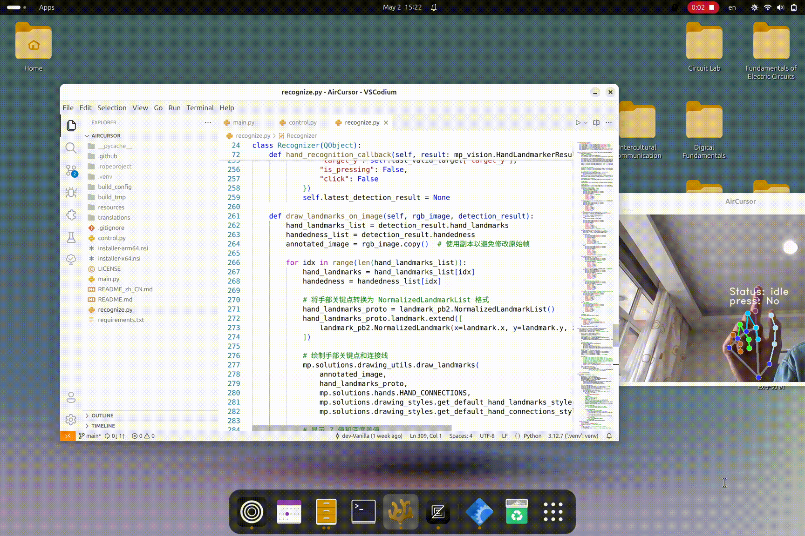

<h4 align="right"> 
<span href="README.md">English</span> 
<a href="README_zh_CN.md" 
style="margin: 0 10px;" >中文</a> 
</h4>

<p align="center">
    
</p>

<p align="center">
    <a href="https://github.com/dev-Vanilla/AirCursor/releases"></a>
    <a href="https://github.com/dev-Vanilla/AirCursor/stargazers"></a>
    <a href="https://github.com/dev-Vanilla/AirCursor/actions/workflows/build.yaml"></a>
    <a href="https://github.com/dev-Vanilla/AirCursor/blob/main/LICENSE"></a>
   </a>
</p>


<h1 align="center">AirCursor</h1>
<p align="center">
    <strong>Control your PC directly with your hands.</strong>
</p>

<p align="center"><em>"We'll use the best pointing device in the world.  
We're gonna use a pointing device that we're all born with — our fingers."</em></p>  
<p align="center">— Steve Jobs, Macworld 2007: The iPhone Introduction</p>





## Overview

For decades, the mouse, touchpad, keyboard, and screen have dominated human-computer interaction. While these tools are effective, prolonged use can be tiresome, and they may feel limiting in an era of rapid technological advancement. What if you could control your computer with simple hand gestures in the air? Inspired by this vision—and recent AR innovations—I created **AirCursor**, a gesture-controlled mouse application.

AirCursor leverages **MediaPipe** for real-time hand tracking and **PySide6** for the user interface, enabling intuitive control of your computer through hand gestures. With no additional hardware required, AirCursor transforms simple movements into precise mouse inputs, such as moving the cursor, clicking, dragging, and scrolling—all with just your fingers.

This project is designed to be lightweight, cross-platform, and easy to use, making it accessible to developers and casual users alike.

---

## Features

- **Real-Time Gesture Recognition**: Supports hand landmark detection with high precision.
- **Low Hardware Dependency**: Works with any device equipped with a camera.
- **Cross-Platform Support**: Compatible with Windows, macOS, and Linux, on both ARM and x64 platforms.
- **Mouse Operations**:
  - 🖐️ **Move**: Point with your index finger to move the cursor.
  - 🫵 **Click**: Pinch your thumb and index finger to perform a click.
  - 🤏 **Drag**: Keep pinching and move your hand to drag items.
  - ✌️ **Scroll**: Swipe your palm up or down to scroll.
- **System Tray Support**: Minimize to the system tray and run as a background service.
- **Customizable Sensitivity**: Adjust sensitivity for clicking, moving, and scrolling.

### Planned

Here’s what we’re working on next:

- [ ] **More Gestures**: Minimize, Maximize, Close windows, Swiching desktops ...
- [ ] **Customizable Gestures**: Allow users to define their own gestures.
- [ ] **Linux Wayland Support**: Extend compatibility to Linux Wayland environments.
- [ ] **Multi-Language UI**: Add support for multiple languages.
- [ ] **Improved Performance**: Optimize gesture recognition algorithms for lower latency.
- [ ] **Hardware Integration**: Explore integration with AR/VR devices for immersive experiences.
- [ ] **Gesture Combination Support**: Enable multi-hand and multi-finger gestures.

### Compatibility

| Platform       | Environment      | Status        |
|----------------|------------------|---------------|
| **Windows**    | All versions     | ✅ Supported  |
| **macOS**      | macOS 10.15+     | ✅ Supported  |
| **Linux**      | Wayland          | 🚧 Planned    |
|                | Xorg             | ✅ Supported  |

---

## Quickstart

### Try AirCursor
1. Go to the [GitHub Releases page](https://github.com/dev-Vanilla/AirCursor/releases) and download the executable file for your platform:
   - `.exe` for Windows
   - `.app` for macOS
   - `.bin` for Linux
2. Double-click the downloaded file to run the application.
3. Enjoy controlling your computer with gestures!

### Installation
1. Visit the [GitHub Releases page](https://github.com/dev-Vanilla/AirCursor/releases) and download the installation package for your platform:
   - `.msi` for Windows
   - `.dmg` for macOS
   - `.deb` or `.rpm` for Linux
2. Install the package using your platform's standard installation process.
3. Launch the application and start using it immediately.

---

### Usage Instructions

1. After launching the application, enable gesture recognition via the system tray menu (right-click the tray icon and select "Start").
2. Control the mouse with the following gestures:
   - ☝️ **Move**: Point with your index finger to move the cursor.
   - 🫵 **Click**: Pinch your thumb and index finger to perform a click.
   - 🤏 **Drag**: Keep pinching and move your hand to drag items.
   - ✌️ **Scroll**: Swipe your palm up or down to scroll.
3. You can pause or exit the service via the system tray icon.

---

## Development Guide

### Quick Start

To set up the development environment, follow these steps:

```bash
git clone https://github.com/dev-Vanilla/AirCursor.git
cd AirCursor
pip install -r requirements.txt
python3 main.py
```

### Dependencies

Ensure you have the following dependencies installed:
- Python 3.12+
- OpenCV (`pip install opencv-python`)
- MediaPipe (`pip install mediapipe`)
- PySide6 (`pip install PySide6`)
- pynput (`pip install pynput`)

---

### Contribution Guidelines

Community contributions are welcomed! Here’s how you can help:

- **Report Bugs or Suggest Features**: Submit an issue via the [Issues](https://github.com/dev-Vanilla/AirCursor/issues) page.
- **Submit Pull Requests**: Fork the project, make your changes, and submit a pull request with detailed descriptions of your improvements.
- **Spread the Word**: Share AirCursor with others who might find it useful!

When contributing code, please ensure:
- Your code adheres to the project's coding standards.
- You include clear and concise documentation for any new features.
- You test your changes thoroughly before submitting.

---

### License

This project is licensed under the [AGPL v3](https://www.gnu.org/licenses/agpl-3.0.txt). For more details, see the [LICENSE](LICENSE) file.

---

### Contact

For questions or feedback, feel free to reach out to me at [vanillayhd@outlook.com](mailto:vanillayhd@outlook.com).

Join us in redefining the future of human-computer interaction!
